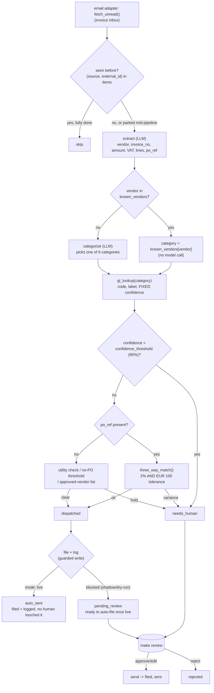

# Finance Filing AI — "The Bookkeeper"

Scans inboxes and Drive for invoices/receipts, reads each PDF, codes it to
the right ledger category, matches it to its purchase order, files it to
the right folder with a clean name, and logs it to the finances sheet,
automatically. Emails a daily summary of what it filed.

Clone this repo, open Claude Code inside it, and your own Claude session
sets it up and runs it. It knows nothing about the company that built this
template — everything it needs is in this folder.

## What it does

**Does.** Scans inboxes and Drive for invoices/receipts, reads each PDF,
codes it to the right ledger category, matches it to its purchase order,
files it to the right folder with a clean name, and logs it to the finances
sheet, automatically. Emails a daily summary of what it filed.

**Won't.** Flags only the genuinely ambiguous document for a human glance —
below 90% confidence on a ledger code it asks instead of guessing. Does the
capture, coding and filing, not the accounting.

**Why.** Receipt admin is the chore everyone hates and does late. This
keeps the books current and audit-ready with near-zero effort.

**What to expect.** Files the bulk of invoices fully automatically, daily;
turns month-end scramble into a non-event.

**Roughly what it's worth.** −90% invoice-filing labor, in the source
material's own estimate. Treat that as directional, not a guarantee for
your property — see `docs/benefits.md` for how to measure your own numbers.

A note on the promise, up front, because this README will not repeat a
claim the code cannot back up: "reads each PDF" means it reads whatever
text your mailbox hands over — a real OCR/PDF-to-text step for scanned
attachments is not built yet (see "Connect your systems"). And "matches it
to its purchase order" stops at *clear to file* versus *held*: no payment
is ever scheduled or released here — see "What it won't do" under
Guardrails.

## Who it's for

A hotel, restaurant, or small hospitality group that gets a steady drip of
supplier invoices — cleaning supplies, F&B deliveries, utilities,
maintenance contractors, software subscriptions — and does not have a
full-time bookkeeper watching the inbox every day. If invoice filing
currently happens in a burst before month-end, or the books are always a
week or two behind, this agent is for you.

It assumes:

- You can get invoices into a mailbox this agent reads (a dedicated
  `invoices@` alias works best), or you are comfortable asking your Claude
  session to write a real text-extraction step for scanned PDFs
  (`docs/integrations.md`).
- You have someone who works the review queue at least a few times a week
  to start — this agent files the confident cases and queues the rest; it
  is not meant to run fully unattended from day one, even once live.
- You are fine starting in `shadow` mode (compute and queue only) for a
  while before trusting it to file anything on its own.

`venues: hotel, restaurant`. Everything below is written for a hotel; for a
restaurant the unit of work is the same (a supplier invoice), the ledger
map collapses toward F&B cost of sales with sub-splits, and the no-PO
threshold is usually lower — see "Customising", "The restaurant lens".

## How it works



**The model reads, the code decides.** Two model calls per invoice —
`extract` (read the document) and `categorize` (pick a category, only when
a vendor is not already in your `known_vendors` table). Everything after
that — the GL code, its confidence, the PO tolerance check, the no-PO
rules, the filename — is plain Python, and confidence is a fixed number
per category, never something the model reports about itself. See
`docs/how-it-works.md` for the full reasoning.

**The one autonomous path in this family.** Every other template in this
factory queues everything for a human, always. This agent is built
differently, because the roster's own promise is different: the ~90% of
invoices that clear the confidence gate, the PO check and the no-PO rules
file themselves — once `mode: live`. `mode: shadow` (the default) still
blocks every write completely; a confident invoice queues as
`pending_review` instead, showing you exactly what it would have done.

**The review queue.** An invoice lands as `needs_human` (a low-confidence
code, a PO variance, a utility bill over ceiling, a no-PO invoice over
threshold or from an unapproved vendor) or files itself. A person works the
queue with `make review` and `python3 tools/review.py` — approve, correct,
reject, or send. See `workflows/80-review.md`.

**What runs when:**

| Step | Command | Suggested cadence | Talks to |
|---|---|---|---|
| Scan the inbox, code, match, file | `make run` | hourly | email adapter, PO ledger, meter feed, sheets |
| Human review | `make review` | daily | — |
| Daily summary email | `python3 tools/digest.py` | once a day (morning) | email adapter |
| Benefit numbers | `make report` | weekly | — |

**Sub-agents in this repo:** none. No coach layer either — this promise
sits with Front Desk AI, Concierge AI, Upsell AI and CRM/Lead Nurture AI,
not here.

**What a held invoice's reason actually looks like.** A price variance,
the set piece this repo was built around:

```
Price variance: invoiced EUR 1719.00 against PO-1001 at EUR 1572.50 - +9.3%
(EUR 146.50 over) on 'Fresh seafood delivery, weekly order'. Above the 2.0%
/ EUR 100 tolerance, so the payment stops here.
```

A clean no-PO invoice under the threshold, from an approved vendor, needs
no reason at all — it just files.

## What you need

- **A mailbox for invoices.** The `mock` adapter (no setup) reads the
  bundled sample invoices. For a real property, a dedicated `invoices@` or
  `accounts@` alias, read over IMAP or Gmail — see "Connect your systems".
- **Your chart of accounts, roughly.** Five ledger categories with their GL
  codes (`config/agent.yaml: gl_map`) is the starting shape; add more if you
  need them.
- **Your recurring vendors, roughly.** A short `known_vendors` list saves a
  model call on every invoice from a supplier you already know.
- **A spreadsheet, optionally**, if you want the finances log and
  `python3 tools/report.py --export` to write somewhere other than a local
  CSV.
- **Your own Claude Code subscription**, already open in this folder — that
  is what walks you through setup and is enough for real volume on most
  properties. A metered API key is optional, for high volume or unattended
  server deployment.
- **About 10 minutes** for the quick start below, and maybe half an hour to
  fill in your own vendors, GL codes and thresholds.

## Quick start (5 minutes, no credentials)

```bash
git clone https://github.com/th1-ai/finance-filing-ai.git finance-filing-ai
cd finance-filing-ai
make setup
make demo
```

`make setup` creates a virtual environment, installs the (tiny) dependency
list, and copies the example config files. `make demo` runs the whole loop
against nine invented sample invoices — no credentials, no network. Expect
something close to this:

```
Finance Filing AI demo - 9 sample invoice(s) from fixtures/inbound/

  invoice-01: CleanNest Supplies EUR 249.0 -> category=Housekeeping confidence=0.97 gl=6210 match=no_po [would-auto-file (shadow-blocked)]
  invoice-02: Baía Fresca Seafood EUR 1719.0 -> category=F&B confidence=0.96 gl=5110 match=variance [NEEDS_HUMAN]
  invoice-03: Costa Watt Energia EUR 8500.0 -> category=Utilities confidence=0.99 gl=6410 match=no_po_utility_ok [would-auto-file (shadow-blocked)]
  invoice-04: Serra Blue Water Co EUR 950.0 -> category=Utilities confidence=0.99 gl=6410 match=no_po_utility_flag [NEEDS_HUMAN]
  invoice-05: Vale Grande Contractors EUR 2400.0 -> category=Property confidence=0.95 gl=6310 match=no_po [NEEDS_HUMAN]
  invoice-06: Skyline SaaS Co EUR 89.0 -> category=Software confidence=0.98 gl=6720 match=no_po [would-auto-file (shadow-blocked)]
  invoice-07: Unknown Traders Ltd EUR 310.0 -> category=Sundry confidence=0.55 gl=6900 match=- [NEEDS_HUMAN]
  invoice-08: GreenScape Grounds EUR 648.0 -> category=Property confidence=0.95 gl=6310 match=ok [would-auto-file (shadow-blocked)]
  invoice-09: CleanNest Supplies EUR 410.0 -> category=Housekeeping confidence=0.97 gl=6210 match=no_po [NEEDS_HUMAN]

5 of 9 need a person to look first - below the 90% confidence gate, a price variance, or a hold with no matching PO (see docs/safety.md).
Nothing was filed or logged: mode is shadow, and the write guard blocks it regardless of confidence - see docs/how-it-works.md.
Next: `make review` to see what is waiting, or read workflows/10-invoice-filing.md.

DEMO OK — 9 items processed, 4 would auto-file once live, 5 need a human (shadow)
```

That last line is the one to check: `DEMO OK` means every piece — the
fixtures, the vendor table, the GL map, the PO ledger, the meter feed — is
wired up correctly on your machine. Look at what a held invoice actually
says:

```bash
make review
python3 tools/review.py show <id>
```

Add a vendor to `config/agent.example.yaml: known_vendors` and run
`make demo` again — that category is now coded from the table, no model
call. (`make demo` always runs on the shipped sample config, never your
live one; in a real run, `make run` reads the same table from
`config/agent.yaml`.) That is the whole design: every config value
changes real output, not just a log line.

Then `make doctor` — expect one `FAIL` (`hotel identity`, because the
property is still the shipped placeholder "Hotel Aurora") and a few `warn`
lines. That is the intended state of a fresh clone; see
`workflows/00-setup.md` for filling in the real property.

## Set up with Claude Code

Open `claude` in this folder. Work through these in order — each names the
workflow file Claude will actually follow, so you can read ahead if you want.

**Phase 1 — first run.**

> Read `workflows/00-setup.md` and walk me through it. I want the demo
> running first, then help me fill in my property details, my ledger
> categories and my recurring vendors.

**Phase 2 — connect a real invoice inbox.** Skip this while you are still
deciding.

> Read `docs/integrations.md`. I want to connect a real invoice mailbox —
> here's what I have: <IMAP details, or a Gmail account>. Also help me
> connect a purchase-order export and a meter/utility export if I use
> them. Run `make doctor` to check it.

**Phase 3 — run it and work the queue.**

> Read `workflows/10-invoice-filing.md` and `workflows/80-review.md`. Run
> the agent once, show me what it coded, what it would auto-file, and what
> it held, and walk me through approving, correcting, and rejecting a few.

**Phase 4 — going live.**

> Read `workflows/90-go-live.md`. Go through the checklist honestly and
> tell me what is and is not ready. Explain plainly that once live, a
> confident invoice files itself with no further approval. Do not switch
> anything without me saying yes.

## Connect your systems

This agent uses four systems. Full status table and setup steps in
`docs/integrations.md`; the short version:

| System | Adapter you'll actually use | Status | Needs |
|---|---|---|---|
| Email (invoice inbox + digest) | `mock` (demo) or `imap`/`gmail` | universal / built | Nothing, or a mailbox |
| Sheets (finances log + report) | `csv` or `google` | universal / built | Nothing, or a service account |
| PO ledger | `mock` (demo) or `csv` | universal | Nothing, or a purchase-order export |
| Meter feed | `mock` (demo) or `csv` | universal | Nothing, or a utility/BMS export |

**"Reads each PDF" is not yet real OCR.** `extract` reads whatever text the
email adapter hands over — plain-text or HTML invoice email works today;
a genuinely scanned PDF needs a text-extraction step this repo does not
ship yet. `docs/integrations.md`, under "Implement your own", has the recipe.

This agent does **not** use a PMS or WhatsApp/chat messaging — `make doctor`
still prints generic `pms adapter` and `messaging adapter` lines (every
repo in this family shares the same health check); they are not relevant
here.

Check what is actually working at any time:

```bash
make doctor
```

## Run it

```bash
make run                        # one pass over the invoice inbox
make run ARGS="--limit 10"      # just the first ten
make run ARGS="--dry-run"       # compute everything, write nothing at all
make watch                      # loop on the configured interval
python3 tools/schedule.py --all  # cron / launchd / systemd snippets, one per job
python3 tools/digest.py          # build (and queue) today's summary email
```

`config/agent.yaml: schedule` names each recurring job with its own command
and cadence (`invoice-filing`: hourly; `daily-digest`: morning) —
`python3 tools/schedule.py --all` prints a ready-to-paste snippet for each
one; `scheduler/` has cron, launchd (macOS) and systemd examples.

Work the queue with `make review` and `python3 tools/review.py` (list, show,
approve, edit, reject, retry, send — see `workflows/80-review.md`).

**On cost:** `extract` and `categorize` run on every new invoice, so this
is where real spend happens — see `docs/safety.md` for the honest,
subscription-vs-API breakdown, and `make report` for the running total.

## Go live

Shadow (compute and queue only) is the default and the right place to stay
until you trust the decisions. The full checklist is in
`workflows/90-go-live.md`; in short:

- [ ] `make doctor` is clean.
- [ ] Your real GL codes, known vendors, approved vendors and thresholds are
      in `config/agent.yaml` — not the shipped examples.
- [ ] You have run this on real invoices for a while and the held reasons
      look right.
- [ ] You have connected a real PO ledger and meter feed if you use them —
      otherwise every PO-named or no-PO-utility invoice holds by default.

Then, after clearing the shadow-era queue (`python3 tools/review.py stale`),
in `config/hotel.yaml`:

```yaml
mode: live
```

**What changes:** a confident invoice now really files itself and logs a
finances-sheet row, with nobody touching it — that is this repo's specific
promise, and it is different from every other agent in this family.
**What does not change:** the 90% confidence gate, the PO tolerance, and
the no-PO rules — an invoice that would have been held in shadow is still
always held in live.

## Guardrails & safety

Full detail in `docs/safety.md`. The essentials:

- **Never posts an uncoded invoice.** Below the confidence gate, or with
  `gl-auto` off, an invoice is always held — never guessed.
- **Never pays without a purchase order above the no-PO threshold**
  (EUR 1,000 by default), and never clears a small no-PO invoice from a
  vendor that is not on the approved-vendor list.
- **Never clears a utility bill it cannot reconcile to consumption.** No
  meter data, or more than 15% above the contracted ceiling, and it is held.
- **A percentage breach alone never stops a payment** — it must also
  breach the euro tolerance; either alone clears with a note instead.
- **Never schedules or releases a payment.** This agent stops at "clear to
  file" versus "held" — see `docs/how-it-works.md`, decision 11.
- **`mode: shadow` blocks every write, approved or not.** Filing and the
  sheet log are guarded exactly like any other write in this family.

**Telling people this was AI-produced.** There is no guest-facing text
here — the one message this agent sends, the daily digest, goes to your
own manager or controller, not a third party. If you forward it outside the
business, say plainly in your own note that it was produced by an AI agent
under your supervision. Full wording guidance in `docs/safety.md`.

## Customising

**The two rules**, both in `config/agent.yaml`, both on by default:

| Rule | On | Off |
|---|---|---|
| `gl-auto` | invoices get a ledger code and can file | every invoice held, no code assigned |
| `utility-anomaly` | a no-PO utility bill is checked against the meter feed | it clears "on trust", no meter check |

- **`known_vendors`** — vendor name (lower case) → ledger category, plus
  `utility_type` (`electricity`/`water`) for a Utilities vendor. Skips the
  `categorize` model call entirely.
- **`approved_vendors`** — who may clear a small no-PO invoice under
  `matching.no_po_threshold_eur`.
- **`gl_map`** — your real GL codes, labels, and the fixed confidence per
  category that the 90% gate checks. Add a category by adding a row.
- **`matching`** — PO tolerance (`tolerance_pct`, `tolerance_eur`) and the
  no-PO threshold.
- **`utility`** — the window, the two tariffs, and the over-ceiling
  tolerance for the utility cross-check.
- **`confidence_threshold`** — the 90% gate itself.
- **Adding a category.** Add a row to `gl_map`; the `categorize` prompt's
  schema also needs the new name added to its `enum` in
  `prompts/schemas/categorize.json`.

**The restaurant lens.** For a restaurant rather than a hotel: the unit of
work is the supplier invoice (produce, drinks, dry goods), the ledger map
collapses toward F&B cost of sales (5110) with sub-splits by category
(food / wine / beer & spirits / non-alc / packaging), and the utility
cross-check's per-room-night denominator becomes per cover — swap
`meter-readings`'s `occupied_rooms` column for a covers count from your POS
export. The no-PO threshold is usually much lower — a EUR 1,000 floor waves
through most of a week's produce, so lower `matching.no_po_threshold_eur`
to match your real order sizes.

## Troubleshooting & FAQ

Full page: `workflows/99-troubleshooting.md`. Quick answers:

**"`make doctor` shows a FAIL on `pms adapter` / `messaging adapter`."**
Expected and safe to ignore — this agent does not use either.

**"An invoice keeps calling the categorize model even though I know the
vendor."** Add it to `config/agent.yaml: known_vendors`.

**"A held invoice's reason mentions the approved-vendor list."** Check
`approved_vendors` — it is separate from `known_vendors` on purpose (a
vendor can be a known category and still not be pre-approved for no-PO
spend).

**"`python3 tools/review.py send` says blocked."** Expected while
`mode: shadow` — see "Guardrails". Approve it anyway to record the
decision, then go live when ready.

**"Can `extract` read a scanned PDF straight from an attachment?"** Not
yet — see "Connect your systems" and `docs/integrations.md`, under
"Implement your own", for the recipe to add a real OCR/text-extraction step.

## Measuring the benefit

```bash
make report                       # auto-filed rate, held value, edit rate, spend
python3 tools/report.py --export   # also writes to your sheets adapter
```

The roster's promise is "files the bulk of invoices fully automatically" —
`docs/benefits.md` has the full breakdown of what to track and the honest
caveats (the auto-filed share depends on how well `known_vendors` and
`gl_map` match your real chart of accounts and vendor mix).

## About

Built by [TH1](https://th1.ai) — AI agents for independent hotels. This
repo is MIT licensed (see `LICENSE`); take it, run it yourself, change
anything.

If you would rather have this set up and run for you, or want a real
document-extraction step built for your specific mailbox, get in touch
through [th1.ai](https://th1.ai).

**Changelog.** This is the first published version of this template.
