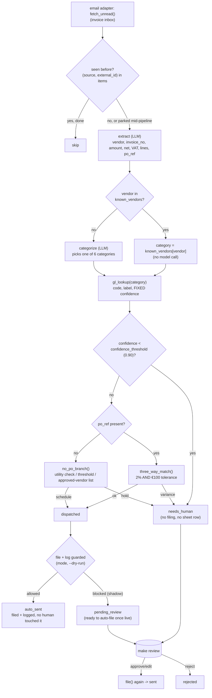

# How it works

Finance Filing AI ("The Bookkeeper") reads incoming supplier invoices and
receipts, works out which ledger category and GL code they belong to, checks
them against a purchase order (or, when there is none, against a sensible
fallback rule), files the document under a clean name, and logs a row to the
finances sheet. Once a day it emails a summary of what it filed. It never
touches money — no payment is scheduled or released by this repo.

## The central design choice: the model reads, the code decides

Two, and only two, model calls exist in the main loop:

1. **`extract`** — turn the invoice's raw text into structured fields (vendor,
   invoice number, date, net, VAT, line count, and a purchase-order reference
   if the document names one).
2. **`categorize`** — pick a ledger category, but **only when a deterministic
   vendor lookup does not already know the answer**.

Every decision after that — which GL code a category maps to, what
confidence that code carries, whether an invoice clears or is held, the
purchase-order tolerance check, the utility cross-check, the no-PO threshold,
the filename — is plain Python over the extracted fields. No model ever sees
or produces a confidence number: **confidence is a property of the category**
(`config/agent.yaml: gl_map.<category>.confidence`), the same fixed value
every time, because that is what makes the 90% gate an auditable business
rule instead of a model's self-report. See `tools/engine.py`.

This mirrors the property this repo was built from: *"No LLM touches any
number here."* The two model calls here read a document and name a category;
they do not touch a euro figure, a tolerance, or a threshold.

## The loop



**Why this agent, unlike its siblings, has a genuine unattended path.** Every
other template in this family queues everything for a human, always — see
`front-desk-ai` or `review-response-ai`. The roster promise here is
different and explicit: *"Files the bulk of invoices fully automatically,
daily"* and *"below 90% confidence on a ledger code it asks instead of
guessing"* — meaning the *other* ~90% should not need a human at all once you
trust it. `core/store.py`'s state machine already has a path for exactly
this: `new → dispatched → auto_sent`, unused by every other repo in this
family so far. This repo is the first to actually walk it. The 90% confidence
gate, the PO tolerance, and the no-PO rules are the safety valve that makes
autonomy defensible instead of reckless — and `mode: shadow` still overrides
all of it: **nothing files or gets logged until `mode: live`,** no matter how
confident the code is. In shadow, a would-auto-file invoice is queued as
`pending_review` instead, with a note saying it is ready to go once live.

## What runs when

| Step | Command | Suggested cadence | Talks to |
|---|---|---|---|
| Scan the inbox, code, match, file | `make run` (`workflows/10-invoice-filing.md`) | hourly | email adapter, PO ledger, meter feed, sheets |
| Human review (ambiguous / held items) | `make review` (`workflows/80-review.md`) | daily | — |
| Daily summary email | `python3 tools/digest.py` (`workflows/15-daily-digest.md`) | once a day | email adapter (send) |
| Optional controller's note (off by default) | `python3 tools/narrate.py` | with the digest | LLM provider |
| Benefit numbers | `make report` | weekly | — |

## Data model

One `items` row per invoice (`core/store.py`), `kind="invoice"`, `source` is
the mailbox, `external_id` is the email/message id. A second `items` row per
digest (`kind="digest"`) so the daily summary goes through the same queue and
guard as everything else.

- `payload` — the inbound email fields, plus two private resume caches:
  `_extract_cache` (set once `extract` succeeds) and `_category_cache` (set
  once a category is known, from either the vendor table or `categorize`).
  See "Resumable stages" below — this is the whole mechanism.
- `intent` — the ledger category (`Housekeeping`, `F&B`, `Utilities`,
  `Property`, `Software`, `Sundry`).
- `confidence` — the fixed per-category value from `gl_map`/`sundry` in
  `config/agent.yaml`.
- `draft` — the full decision record once computed: `{vendor, invoice_no,
  amount_eur, extracted, gl_code, gl_label, po_ref, match, action, notes,
  filed_name, category, category_source}`. `category_source` is
  `known_vendor` or `categorize` — always shown, so you can see when the
  vendor table saved a model call. It is `mock_unmatched_vendor` only in
  `llm.provider: mock` (demo/test) mode, when a vendor is neither in
  `known_vendors` nor covered by a canned answer under
  `fixtures/expected/categorize/` — see "Design decisions" below, #16.
- `review_status` — the shared FSM. A confident, clean invoice moves
  `new → dispatched → auto_sent` (or `pending_review` in shadow). An
  ambiguous or held one moves `new → needs_human` directly — `dispatched`
  is never touched, because it never earned the attempt.

No new SQL tables. Purchase orders and meter readings are read from small
domain-specific readers in `tools/` (`po_ledger.py`, `meter_feed.py`) rather
than `core/store.py`, because they are reference data the agent reads, not
work items it moves through a state machine — see "Core requests" in the
build report for why they are not core adapters yet.

## Resumable stages (the interactive-provider trap)

**The trap, found in two sibling builds first:** with the `interactive`
provider, a hotel's Claude session answers one pending prompt, re-runs the
command, and a *second* model call in the same item's pipeline pends. If the
next `make run` bulk-fetches new mail and pre-filters with
`store.already_processed()` before deciding what to do with each message, an
item that only got as far as `extract` looks "already there" and is silently
never asked to `categorize`. It sits forever, invisible, never filed and
never queued for a human either.

**The fix, in two parts, both required:**

1. **`already_processed()` does not count a row still in `review_status =
   'new'`** (this is enforced in `core/store.py`, not something a builder can
   get wrong by omission). A parked item is retried on the next pass, not
   skipped.
2. **This agent only leaves `new` once the whole decision is computed** —
   `store.transition()` is called exactly once per invoice, at the very end
   of `process_invoice()` in `tools/engine.py`, after `extract`,
   `categorize` (if needed), the GL lookup, and the match/no-PO decision are
   all done. Everything in between is cached on `payload` with
   `store.set_fields()`, keyed on which LLM call actually finished — not
   whether the item merely *exists*:

   ```python
   existing = store.get_by_external("invoices", msg.id)
   item = store.upsert_item("invoices", msg.id, kind="invoice", payload=...)
   if item.draft is not None:
       return item, False          # fully processed by an earlier pass
   extracted = (item.payload or {}).get("_extract_cache") or extract(...)
   category, source = (item.payload or {}).get("_category_cache") or categorize_or_lookup(...)
   ...                              # deterministic from here — never pends
   store.transition(item.id, status, ...)   # the ONLY transition off "new"
   ```

   `tests/test_finance_filing_loop.py::test_interactive_retry_resumes_at_categorize_not_extract`
   is the regression test: it runs an unknown-vendor fixture on the
   `interactive` provider, answers only the `extract` prompt, confirms the
   item is still `new` and still comes back from a fresh
   `already_processed()` check (i.e. would be retried, not skipped), answers
   `categorize`, re-runs, and confirms `extract` was never asked twice.

## Idempotency

- `(source, external_id)` unique on `items` — a re-run of `make run` never
  redrafts an invoice it has already fully processed.
- Filing and the sheet-row append happen through `store.claim_for_send()`
  when reached via the human-approval path (an atomic conditional UPDATE), so
  two overlapping runs can never file the same invoice twice. The autonomous
  `dispatched → auto_sent` path is a single agent-owned transition with no
  concurrent writer.
- `make demo` runs on its own database (`data/demo/demo.db`), never touches
  `data/agent.db`, and always shows the same nine bundled invoices.
- `--dry-run` computes the whole decision and prints it, but never files,
  never appends a sheet row, and never advances `review_status` past
  `dispatched`/`needs_human` — the guard raises before either write.

## Design decisions (the spec left these open)

The behavioural spec this repo was built from (`specs/finance-filing-ai.md`)
flags several points the original demo left unresolved or admits are
inconsistent. Decisions taken here, and why:

1. **The 90% confidence gate is implemented explicitly**, as
   `confidence < config/agent.yaml: confidence_threshold` in
   `tools/engine.py:gate_confidence()`. The demo this was extracted from
   never actually compared a number to 0.90 anywhere in its code — the gate
   was true only by coincidence of which categories happened to map above or
   below that line. Here it is a real, editable comparison.
2. **Confidence is per-category, not per-invoice, and never model-reported.**
   `gl_map.<category>.confidence` in `config/agent.yaml` is the single
   source of truth (0.95–0.99 for the five real categories, 0.55 for
   `Sundry`). This matches the source material's own numbers and keeps the
   gate auditable: the model picks a category, the confidence is a business
   rule you can read and edit, not something an LLM invented about itself.
3. **`lines` is genuinely extracted, not hard-coded to 1.** The demo this was
   built from hard-codes `extracted.lines: 1` while its own step copy claims
   real line-item extraction. This template asks the `extract` prompt for the
   real count from the invoice text — a small improvement, not a config flag.
4. **A mailbox poller and a daily digest are built from scratch.** The
   roster promises "scans inboxes and Drive" and "emails a daily summary" but
   the demo this was extracted from has no such surface at all (it processes
   whatever is already sitting at `status = 'inbox'`). `tools/run.py` polls
   `systems.email.adapter`; `tools/digest.py` sends the summary. **Drive is
   not implemented** — see `docs/integrations.md` for why (no Drive/SharePoint
   adapter exists anywhere in this family yet) and the recipe for adding one.
5. **A filing convention is invented**, since none existed:
   `YYYY-MM-DD_vendor-slug_invoiceno_amount.ext` (`tools/filing.py:build_filename`).
   Filing itself writes a JSON record, not a real PDF move — this repo never
   receives real PDF bytes (see decision 4), so pretending to relocate a file
   that was never here would be dishonest. A real Drive/SharePoint adapter
   would replace `tools/filing.py`'s write with an actual upload; the naming
   function stays the same.
6. **One water/utility tariff, not two.** The source material prices water at
   €2.15/m³ in one file and €3.60/m³ in another, for the same property. This
   repo has one number, `config/agent.yaml: utility.tariff_eur_per_m3`, used
   consistently, and it is a config value, not a constant — see decision 8.
7. **Utility type comes from the vendor record, with the old regex kept as a
   fallback.** `config/agent.yaml: known_vendors.<name>.utility_type` is
   checked first; the `/water|água|agua/i` match on the vendor name only
   fires for a vendor not in the table. Fragile-by-name detection still
   exists, but it is no longer the only path.
8. **Every threshold that was a hard-coded constant is now a config value**:
   `confidence_threshold`, `matching.tolerance_pct`, `matching.tolerance_eur`,
   `matching.no_po_threshold_eur`, `utility.window_days`,
   `utility.tariff_eur_per_kwh`, `utility.tariff_eur_per_m3`,
   `utility.tolerance_pct` all live in `config/agent.yaml`. None has an audit
   trail beyond the normal git history of that file — a real deployment
   wanting one should add a `learnings`-style table, which is a genuine
   feature to build, not a flag.
9. **An approved-vendor list is real data, not copy.** The source material's
   no-PO branch says "under the threshold and `{vendor}` is on the
   approved-vendor list" without that list existing anywhere. Here,
   `config/agent.yaml: approved_vendors` is a real list, checked in
   `no_po_branch()`: a vendor not on it is held for a retrospective PO even
   under the threshold. Every vendor in `known_vendors` should normally also
   be on `approved_vendors`, but the two lists are independent on purpose —
   an approved vendor's invoice can still need a fresh ledger category call.
10. **Rule-off honesty is carried over.** `rules.gl-auto: false` forces every
    invoice to `needs_human` with the reason "with auto GL coding off there
    is no ledger code to post against" (`tools/engine.py:process_invoice`).
    `rules.utility-anomaly: false` clears a no-PO utility bill without
    checking the meter, with the note "queued on trust" — both wordings
    carried over from the spec, both are real behaviour, not log-only.
11. **The 3-way match and the payment queue are not this repo's job.** The
    roster's "matches it to its purchase order" is implemented here — the PO
    tolerance check runs in this loop — but *scheduling a payment* is
    explicitly out of scope (`cant`: "does the capture, coding and filing,
    not the accounting"). A sibling agent in this family, Procure-to-Pay AI,
    owns the payment-run half of the same demo page this was extracted from.
    This repo stops at "clear to pay" versus "held", never at "paid".
12. **No PDF text extraction is implemented.** `extract` reads whatever text
    the email adapter hands it (`EmailMessage.body_text` /
    `extra.raw_text`) — real OCR/PDF-to-text is a genuine feature to add
    before this repo works on real scanned invoices, not a config flag. See
    `docs/integrations.md#implement-your-own`.
13. **No per-recipient reply language.** The family-wide rule is: an agent
    that writes to someone replies only in a language listed in
    `hotel.languages`, else it uses the default language and queues a
    `needs_human` with the reason "wrote in `<lang>`, not in
    `hotel.languages`". This repo has no such branch, on purpose: it never
    drafts a reply *to* whoever sent an invoice, in their language or any
    other — the only outbound message is the daily digest to the property's
    own manager (`contacts.escalation_email`), always written in the
    operator's own working language. An invoice in any language is captured,
    coded and filed the same way; nothing about it is ever echoed back to
    the vendor.
14. **`--dry-run` writes nothing to the agent's own state.** No `items` row
    (not even a `new` one), no `_extract_cache`/`_category_cache`, no
    `events` audit row for the `extract`/`categorize` calls, no filed JSON,
    no finances-sheet row — `tools/engine.py:process_invoice` branches on
    `settings.dry_run` at every one of those points and keeps the computed
    item in memory only (see the function's own docstring). Two things are
    deliberately NOT suppressed: `core.log.Run`'s `runs` bookkeeping row
    (start/finish time, stats) and `data/logs/*.jsonl`, because "a rehearsal
    happened, here is what it computed" is exactly what those exist to
    record — and the `interactive` provider's own `data/pending/*.prompt.md`
    file, without which `--dry-run` could never preview a prompt at all.
15. **A PO match checks the vendor, not just the reference number and the
    price.** `tools/engine.py:three_way_match()` loads `po.vendor` from the
    ledger and compares it (accent/case-insensitive) to the invoice's own
    extracted vendor before it ever looks at the amount. A close-amount
    invoice against someone else's PO is a wrong PO, not a clean match —
    `match: "vendor_mismatch"`, held, reason "this PO belongs to
    `<vendor>`" — whatever the tolerance says. Added after SIMULATION.md
    Finding 1: the original three_way_match matched purely on `po_ref` +
    amount, and a wrong-vendor invoice against a real PO cleared to file
    unseen whenever the amount happened to land in tolerance.
16. **The mock provider never lets a placeholder read as a real answer.**
    `core.llm`'s `mock` provider (`core/llm.py:_mock`) falls back to the
    JSON schema's first enum value when no `fixtures/expected/<task>/<id>.json`
    exists for an item — useful for exercising code paths, worthless as a
    categorization. `tools/engine.py:run_categorize()` checks
    `LLMResult.cached` (True only for a real fixture match) and, when the
    mock provider had to guess, overrides the category to `Sundry` and sets
    `category_source: "mock_unmatched_vendor"` — Sundry's confidence is
    always below `confidence_threshold`, so the item lands on `needs_human`
    instead of silently filing under a fixed high GL confidence. Added after
    SIMULATION.md Finding 4: renaming `known_vendors` to real vendor names in
    demo mode made an unrecognised vendor silently categorize as
    "Housekeeping" at 97% confidence, indistinguishable from a real answer.

## Sub-agents and the coach layer

None. This repo has no children in the roster (`specs/finance-filing-ai.md`
§9) and the Email Optimizer / Coach AI applies only to Front Desk AI,
Concierge AI, Upsell AI and CRM / Lead Nurture AI.
